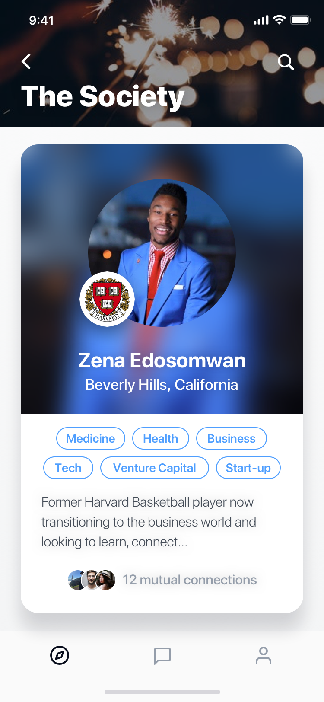

# thekey-mobile



## Setting up the application

```bash
$ git clone https://github.com/hsadev/thekey-mobile.git && cd thekey-mobile
# then cd into directory
$ npm install
$ react-native link
```

## Running the application

Make sure you have the backend running first in a separate terminal:

```bash
$ cd thekey-api
$ npm run db
$ \i config/script.sql # Type in the postgres config script
$ # open a new terminal tab
$ npm start
```

After the backend is running, in a new terminal window, cd into thekey-mobile and execute

```bash
npm run ios
```

to run the frontend.

## Documentation

Features that have currently been implemented:

### Registration

After navigating away from the landing screen, users may choose to register as new users. This process involves providing basic user information like name, email, and password as well as filling out an application, answering a few short essay questions, and uploading a resumé. After this, the applicant must wait to be reviewed by The Key's membership board. Upon approval by the board, the applicant will be notified via email, at which time they will be able to log in to the app.

### Login

Members of the site are able to log in via facebook, LinkedIn, or email. After logging in, the user is navigated to the main app.

### Navigation

Members of The Key are able to explore the app via the main tab navigtor (located at the bottom of the Screen) and the 'Discover' list. The tab navigator offers you the choice to view the 'Discover' screen, the 'Your Network' screen, and the profile screen. The 'Discover' screen has cards that that navigate Members to list views of other Members, Events, Jobs/Internships, and Reviews. On all list views, tapping on the cards takes the Member to a details view of whatever the card was was displaying. At most points in the app, if one would expect a card or photo to be tappable, it probably is and it will most likely follow this details view navigation pattern. At any point, Members can press the 'back arrow' found in the upper left-hand corner of the screen to go back to the previous screen.

### List Views

List views exist so that Members can discover: fellow Members/Groups (via 'The Society'), Jobs/Internships, Events, and Reivews.

#### 'The Society' (Members/Groups)

The Society is Screen that contains a single card. This card may contain either a Member or a Group. If the Card showcases a Member, it displays the Members: name, location, picture, industry tags, short bio, and mutual connection you have with the Member. If the Card is a Group it displays the exact same information with the added 'Group' tag infront of the location line in order to designate it as a group.

The results in The Society are filtered based on the current information you have provided your account. We match Members/Groups based on education, location, industry interests, and several other factors.

The main functionality of The Society is swipping based. Therefore, we you swipe right on a person, this is equivalent to sending a friendRequest and swiping left will take no action. After swiping right on a Member/Group, you are able chat with them after that Member/Group has accepted your friendRequest.

#### Jobs/Internships

Jobs and Internships will be displayed in lists. Members will be able to star Jobs/Internships so that they can easily be viewed via the tab filters at the top of the screen. These tab filters also offer easy access to jobs that the Member as applied for. Upon tapping on one of the Job listings, Members will be taken to a details view about the Job/Internship.

The detail view offers Members the opportunity to see more indepth descriptions about jobs as well as offers them the opportunity to apply for jobs. Applying for a job involves typing up a CV and sending a resumé.

#### Events

Events will be displayed in list views. The main list of Events will be displayed in large cards showcasing the Event's title, location, time and date, interested Members that you may know, and a picture for the event. These events will be selected for you based on your interests, demographics, and other information. There will also be a second list of Events that will displayed on much smaller cards containing the Event's title, date and time, interested Members that you may know, and photo. These Events will be selected for you based on your location.

Regardless of the type of card, clicking the '+' button allows Members to show interest in an Event, adding them to the Event's list of Members.

Upon tapping an Event Card, you are taken to a details view that will give more indepth details about the Event, as well as give you the option to become part of the Chat assciated with the Event.

#### Reviews

TBD

### Friend Requests

Friend requests can be sent in multiple ways. First, a friend request can be sent from the society page by swiping right. Second, a friend request can be sent by navigating to a particular Member's page and tapping the 'connect' button. Third, a friend request may be sent by scanning a Member's QR code. Fourth, a friend request may be sent from 'Your Network' by simply pressing the 'Add Friend' button and using the resulting screen.

### Chat

Members are able to communicate to eachother via both One-to-One and group Chats. Group chats can also be associated with Member defined Groups that will show up in the Society and Events.

#### 'Your Network' (Chat Inbox)

On this screen, Members can view all of their current Chats. Each chat is represented by a card that contains the avatar for the chat (this will be the other Members's photo for a One-to-One chat, the group photo for a Group chat, or the event photo for an Event Chat), the name of the Member/Group/the last sent message in the chat,

This screen also contains a few filter tabs that allow the Member to easily see chats that belong to the following categories: Connection (other Members), Group, Event. This filtering can be made even more specific by using the search bar that will allow you to search through all of you available connections (Members, Groups, and Events).

Members can add new connections via the 'Add Friend' button in the top right corner or add new chats via the 'Add Chat' button in the bottom right corner.

#### Add Friend / Friend Search

TBD

#### Convesation Screen

The Conversation Screen shows the messages of a particular chat. The Header of the chat displays the name of the current recipient (either a Member, Group, or Event) as well as that recipient's photo. Messages sent by you are displayed on the right side of the screen and messages sent by others are on the left. At the bottom of the screen is a message input with a Camera button and a send button.

### Profile

## Designs

The working designs can be found at the following Link: https://github.com/hsadev/thekey-general/tree/master/Designs
